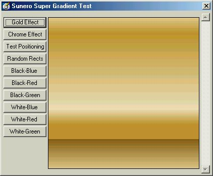



## Super Gradients \(Multiple Colours and custom colour positions supported\)

### Description

Super Gradients is a class that allows you to draw gradients at blazing speeds with n number of colours at required positions. It is incredibly simple to use. Drop the class in your project, give one array containing all the colours and one array containing the position of the colours (positioning is optional) and simply ask it to render.

The given example implementation shows you how to draw Microsoft Word style Gold and Chrome effects. Also includes a demonstration on setting a colour's position in the gradient (use the scrollbar). The next demonstration shows you how to draw Box-style gradients and uses 16 randomly generated colours. Also has examples on simple setup style two colour gradients. All the above stated examples can be seen in the pic below with the Gold effect filled in.

If you have some experience in graphics, you can also use the given functions to implement with very less effort your own gradient styles such as circular, conical or radial, from corners or even diagonal. Please feel free to comment. Thanks.
 
### More Info
 

             |
---                |---
**Submitted On**   |2002-03-01 14:19:42
**By**             |[Sunero Technologies](https://github.com/Planet-Source-Code/PSCIndex/blob/master/ByAuthor/sunero-technologies.md)
**Level**          |Advanced
**User Rating**    |4.5 (18 globes from 4 users)
**Compatibility**  |VB 6\.0
**Category**       |[Graphics](https://github.com/Planet-Source-Code/PSCIndex/blob/master/ByCategory/graphics__1-46.md)
**World**          |[Visual Basic](https://github.com/Planet-Source-Code/PSCIndex/blob/master/ByWorld/visual-basic.md)
**Archive File**   |[Super\_Grad58507312002\.zip](https://github.com/Planet-Source-Code/sunero-technologies-super-gradients-multiple-colours-and-custom-colour-positions-supported__1-32210/archive/master.zip)

### API Declarations

Check Source Code.

